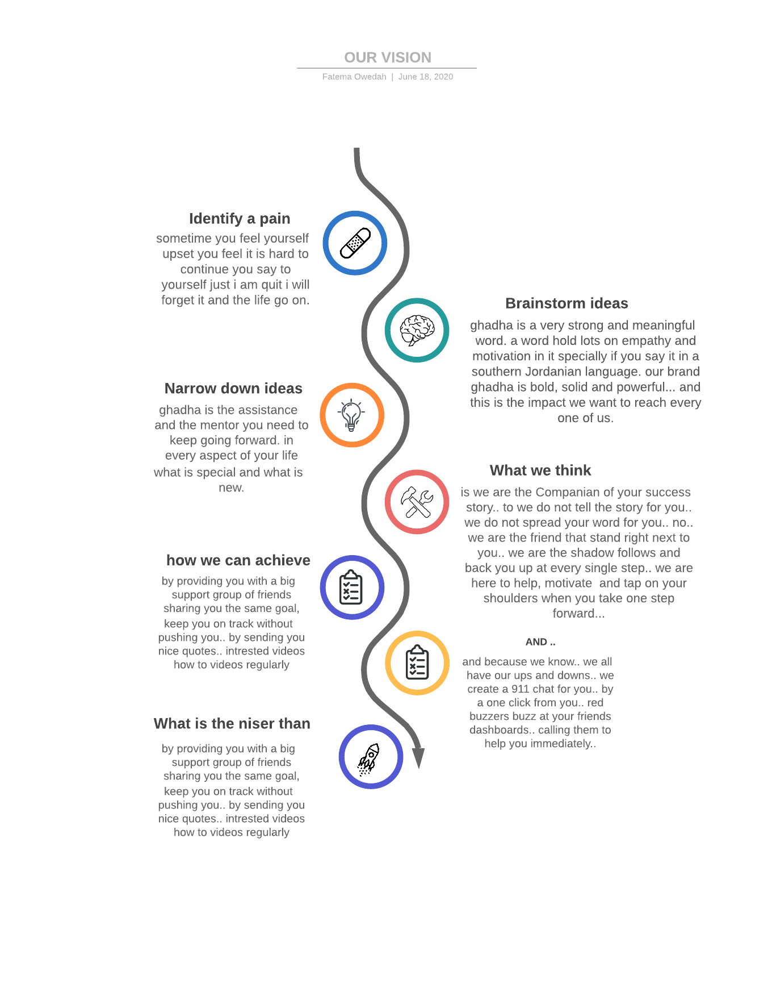

# Software Requirements  

## Idea 
It is a motivational app that motivates the users to move on in their lives, to achieve their goals, to reach success
also, they can see other people success stories or achieved goals from other users
they can publish their own stories so others can motivate from them  

## Vision  
  

## Scop  
 - The web App provide you with a big support group of people sharing their goals and success stories  
 - The web App provide a real time chat between the users  
 - Users will be able to setup their goals and update them anytime  
 - Users will have a wall of their own acheivments  
 - Users will be able to see what other users acheive to encourage them  

## Functional Requirements  
 - As a user, I want to be presented by a simple but elegant user interface.  
- As a user, I want to create a new account so that I may later signin  
- As a user, I want to signin to my account so that I may access protected information  
- As a user, I want to signup/signin using a third party website so that I would have quicker access  
- As a user, I want to create new posts so I can save it on my dashboard  
- As a user, I want to UPDATE/DELETE my posts so that I can control my posts in every way  
- As a user, I want to have the ability to read other user's posts. (public)  
- As a user, I want to read posts for a specific user.  
- As a user, I want to be able to set private goals.  
- As a user, I want to set a due date to finish my goals.  
- As a user, I want to change the state of my goals(pending/completed/failed).  

- As an Admin, I want to be able to update/delete any post.  

- As a developer, I want to use React to create single page application  
- As a developer, I want to connect the backend part with the new frontend  
- As a developer, I want to provide applications and users a token cookie following authentication to facilitate re-authentication on subsequent requests  

## Non-Functional Requirements  
 - Security
   - long secret token key
   - The token expires in 7 days
   - High complexity hashed password
 - Testability

